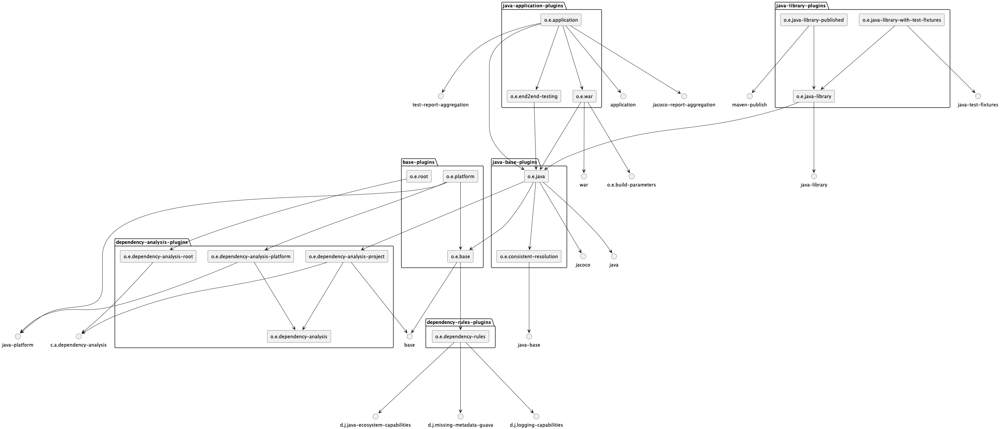

# How to set up a larger Gradle project

This repo shows one possibility to structure a Gradle project when you want:

- **Centralized and maintainable** build configuration and custom build logic
- **No dependency hell** through smart dependency management with dependency rules and analysis

There are four variations of this available:
- How to set up a Gradle [project for **Java**](https://github.com/jjohannes/gradle-project-setup-howto/tree/main)
- How to set up a Gradle [project for **Android**](https://github.com/jjohannes/gradle-project-setup-howto/tree/android)
- How to set up a Gradle [project for **Java Module System**](https://github.com/jjohannes/gradle-project-setup-howto/tree/java_module_system)
- How to set up a Gradle [project for **Kotlin**](https://github.com/jjohannes/gradle-project-setup-howto/tree/kotlin)
- How to set up a Gradle [project for **Java** and **Spring Boot**](https://github.com/jjohannes/gradle-project-setup-howto/tree/spring-boot)

The structure though, is good for any kind of project you may build with Gradle (**Kotlin**, **Groovy**, **Scala**, ...)

This is following the same patterns as [idiomatic-gradle](https://github.com/jjohannes/idiomatic-gradle) but is closer to a _full_ setup that also takes the aspect of continuously changing dependencies into account.

Pick one of these similar videos to get a quick overview:

And here is an overview in a thread on Mastodon:

## Project Overview

Different structuring concerns are summarized in commits if you like to explore things one-by-one:

### Any kind of project

- [Folder structure](https://github.com/jjohannes/gradle-project-setup-howto/commit/folder-structure)  
  A basic structure with all the places to put build configuration.
  Puts everything, which is not a dependency declaration of a concrete subproject, into the `gradle/` folder.
  (Which is a choice, you can put things in different places and still follow the rest of this setup.)
- [Settings plugin](https://github.com/jjohannes/gradle-project-setup-howto/commit/settings-plugin)  
  A settings convention plugin to configure the project structure, repositories, and build locations.
  Uses [org.gradlex:build-parameters](https://github.com/gradlex-org/build-parameters) to pass environment variables into the build.
  - [Video: The Settings File](https://www.youtube.com/watch?v=Ajs8pTbg8as&list=PLWQK2ZdV4Yl2k2OmC_gsjDpdIBTN0qqkE)
  - [Video: Settings Plugins](https://www.youtube.com/watch?v=tlx3tzuLSWk&list=PLWQK2ZdV4Yl2k2OmC_gsjDpdIBTN0qqkE)
- [Dependency rules](https://github.com/jjohannes/gradle-project-setup-howto/commit/dependency-rules)  
  Dependency rules to add more metadata as input to dependency resolution where needed.
  (uses [org.gradlex:java-ecosystem-capabilities](https://github.com/gradlex-org/java-ecosystem-capabilities)).
  - [Video: Capability Conflicts + Component Metadata Rules](https://www.youtube.com/watch?v=5g20kbbqBFk&list=PLWQK2ZdV4Yl2k2OmC_gsjDpdIBTN0qqkE)
- [Base convention plugins](https://github.com/jjohannes/gradle-project-setup-howto/commit/base-plugins)  
  Configure things shared by all projects - like setting a version and consistent resolution.
  - [Video: Dependency Version Conflicts + Consistent Resolution](https://www.youtube.com/watch?v=YYWhfy6c2YQ&list=PLWQK2ZdV4Yl2k2OmC_gsjDpdIBTN0qqkE)
- [Versions](https://github.com/jjohannes/gradle-project-setup-howto/commit/versions)  
  Put all versions into a _platform_; use BOMs where available for libraries that consist of multiple components.
  - [Video: Centralizing Dependency Versions](https://www.youtube.com/watch?v=8044F5gc1dE&list=PLWQK2ZdV4Yl2k2OmC_gsjDpdIBTN0qqkE)
- [Java base convention plugins](https://github.com/jjohannes/gradle-project-setup-howto/commit/java-base-plugins)  
  Configure Java project specifics for compilation and testing in several convention plugins.
  - [Video: The Build Files](https://www.youtube.com/watch?v=OKjE_Lt_66U&list=PLWQK2ZdV4Yl2k2OmC_gsjDpdIBTN0qqkE)
  - [Video: (Convention) Plugins](https://www.youtube.com/watch?v=N95YI-szd78&list=PLWQK2ZdV4Yl2k2OmC_gsjDpdIBTN0qqkE)
  - [Video: Source Sets](https://www.youtube.com/watch?v=74PDtHkS_w4&list=PLWQK2ZdV4Yl2k2OmC_gsjDpdIBTN0qqkE)
  - [Video: Configuring Testing](https://www.youtube.com/watch?v=7f_gBvGQN_0&list=PLWQK2ZdV4Yl2k2OmC_gsjDpdIBTN0qqkE)
  - [Video: The Test Task](https://www.youtube.com/watch?v=YJjNQJSaFww&list=PLWQK2ZdV4Yl2k2OmC_gsjDpdIBTN0qqkE)
  - [Video: The JavaCompile Task](https://www.youtube.com/watch?v=wFewehz6rW8&list=PLWQK2ZdV4Yl2k2OmC_gsjDpdIBTN0qqkE)
- [Java library convention plugins](https://github.com/jjohannes/gradle-project-setup-howto/commit/java-library-plugins)  
  Combine convention plugins to different concrete _library_ types that you use in your `build.gradle.kts` files.
  Test Fixtures
  - (Optional) [Video: Publishing Libraries](https://www.youtube.com/watch?v=8z5KFCLZDd0&list=PLWQK2ZdV4Yl2k2OmC_gsjDpdIBTN0qqkE)
- [Java application convention plugins](https://github.com/jjohannes/gradle-project-setup-howto/commit/java-application-plugins)  
  A specific project is the `:app` project which assembles the final application.
  This is a good place to also aggregate other information like _test result_ and _coverage reports_ for the whole project.
  It is also the place where you often need custom tasks - e.g. to generate additional resources.
  - [Video: Aggregating Custom Artifacts](https://www.youtube.com/watch?v=2gPJD0mAres&list=PLWQK2ZdV4Yl2k2OmC_gsjDpdIBTN0qqkE)
  - [Video: Configuring Task Inputs and Outputs](https://www.youtube.com/watch?v=Pj9hSRauiQM&list=PLWQK2ZdV4Yl2k2OmC_gsjDpdIBTN0qqkE)
  - [Video: Implementing Tasks and Extensions](https://www.youtube.com/watch?v=wrgyUKC7vOY&list=PLWQK2ZdV4Yl2k2OmC_gsjDpdIBTN0qqkE)
  - [Video: Feature Variants](https://www.youtube.com/watch?v=XCzyUESaBHQ&list=PLWQK2ZdV4Yl2k2OmC_gsjDpdIBTN0qqkE)
  - [Video: Test and Code Coverage Reporting](https://www.youtube.com/watch?v=uZvzWlP9BYE&list=PLWQK2ZdV4Yl2k2OmC_gsjDpdIBTN0qqkE)
  - [Video: Detect and Resolve Collisions on a Classpath](https://www.youtube.com/watch?v=KocTqF0hO_8&list=PLWQK2ZdV4Yl2k2OmC_gsjDpdIBTN0qqkE)
- [Lifecycle Tasks and Root project](https://github.com/jjohannes/gradle-project-setup-howto/commit/lifecycle-tasks)  
  Add lifecycle tasks through a convention plugin for the root `build.gradle.kts`.
  - [Video: Lifecycle Tasks](https://www.youtube.com/watch?v=sOo0p4Gpjcc&list=PLWQK2ZdV4Yl2k2OmC_gsjDpdIBTN0qqkE)
- [Customized dependency analysis](https://github.com/jjohannes/gradle-project-setup-howto/commit/analyze-dependencies)  
  You have to take care of your dependencies and versions regularly:
  When your project evolves and when new versions of external dependencies are released.
  Team members not so familiar with the build setup might need to touch only these places.
  Put some dependency analysis in place to help everyone to keep the build tidy over time.
  - Use the superb [dependency-analysis-gradle-plugin](https://github.com/autonomousapps/dependency-analysis-android-gradle-plugin)
  - Write some small custom analysis code that produces actionable error messages that fit your project structure
  - [Video: Clean Compile Classpaths with the Dependency Analysis Plugin](https://www.youtube.com/watch?v=Lipf5piizZc&list=PLWQK2ZdV4Yl2k2OmC_gsjDpdIBTN0qqkE)
- [gradle.properties](https://github.com/jjohannes/gradle-project-setup-howto/commit/gradle-properties)  
  Tune Gradle performance by setting `gradle.properties`.
  - [Video: The JavaCompile Task](https://www.youtube.com/watch?v=wFewehz6rW8&list=PLWQK2ZdV4Yl2k2OmC_gsjDpdIBTN0qqkE)
  - [Video: Caching](https://www.youtube.com/watch?v=nHb0kIcTrFE&list=PLWQK2ZdV4Yl2k2OmC_gsjDpdIBTN0qqkE)

### Any kind of project (except Java Module System)

- [Declare dependencies](https://github.com/jjohannes/gradle-project-setup-howto/commit/declare-dependencies)  
  Declare dependencies between subprojects and external components in the `build.gradle.kts` files.
  - [Video: Declaring Dependencies](https://www.youtube.com/watch?v=igug9tbl4J4&list=PLWQK2ZdV4Yl2k2OmC_gsjDpdIBTN0qqkE)
  - The example has quite some conflicts which are correctly resolved thanks to our dependency rules. Explore in a build scan: https://scans.gradle.com/s/hpjtkjwwhcpzu/dependencies

### Android projects

- [Android plugins](https://github.com/jjohannes/gradle-project-setup-howto/commit/android-plugins)  
  Here, the _Application plugins_ are changed into _Android plugins_ and adjusted to target Android App development using the Android Gradle Plugins.
  - This repo focuses on general project structuring and dependency management with Gradle and does not go into many Android specifics. I recommend to check out https://github.com/android/nowinandroid in addition for that.

### Java Module System projects

- [module-info.java files](https://github.com/jjohannes/gradle-project-setup-howto/commit/module-info-files)  
  Use `module-info.java` files to develop Java Modules. These files already include dependency information.
- [Java Module System Plugins](https://github.com/jjohannes/gradle-project-setup-howto/commit/java-module-system-plugins)  
  Use my _Java Module System_ plugins to enable Gradle to extract the dependency information from the `module-info.java` files and
  to extend the _dependency rules_ to for Java Module specific information.
  - [`id("org.gradlex.java-module-dependencies")`](https://github.com/gradlex-org/java-module-dependencies)
  - [`id("org.gradlex.java-module-testing")`](https://github.com/gradlex-org/java-module-testing)
  - [`id("org.gradlex.extra-java-module-info")`](https://github.com/gradlex-org/extra-java-module-info)
- [Customized dependency analysis (Java Modules)](https://github.com/jjohannes/gradle-project-setup-howto/commit/analyze-requires)  
  Adjusts the above for Java Modules.
  The [java-module-dependencies](https://github.com/jjohannes/java-module-dependencies) plugin already brings some analysis tasks.
- [jpackage Task](https://github.com/jjohannes/gradle-project-setup-howto/commit/jpackage)  
  If the project only uses _real_ modules (i.e. everything is, or gets patched to be, a module with `module-info`) you can add a task to use `jpackage` to package the application.

### Kotlin JVM projects
- [Add Kotlin plugin and Kotlin specific compile configuration](https://github.com/jjohannes/gradle-project-setup-howto/commit/kotlin-jvm-plugin)  
  The setup is similar to the Java project, only that we add the Kotlin JVM plugin on top.
  The plugins that were called `org.example.java` were renamed to `org.example.kotlin` (which makes no difference in the functionality).

## Overview of your Convention Plugins

There is a help task that you can use to get a diagram of the convention plugins defined in the project:

`./gradlew :plugins:analysePluginApplicationOrder`

The task generates a [PlantUML](https://plantuml.com) file that you can render, for example, with the PlantUML IntelliJ plugin.

## Notes

- If you have a question, please ask in an [issue](https://github.com/jjohannes/gradle-project-setup-howto/issues/new).
- The concrete things done in all places (custom tasks, components used in dependencies, additional plugins applied, etc.) are just examples.
  If you, for example, need to use additional Gradle plugins you can add these in the corresponding place, keeping the suggested structure.
- This setup uses a _platform project_ to centralize dependency versions. An alternative approach is to use a _dependency version catalog_.
  If you prefer to use a catalog, because it is the better fit in your case, you can still follow the setup proposed here (just without the `gradle/platform` project).

## FAQ

[List of questions](https://github.com/jjohannes/gradle-project-setup-howto/issues?q=is%3Aissue+label%3Aquestion) asked in issues so far.

- [Why is the :app project special?](https://github.com/jjohannes/gradle-project-setup-howto/issues/4)
- [Dependency Analysis: How to ignore dependencies added by plugins?](https://github.com/jjohannes/gradle-project-setup-howto/issues/6)
- [Dependency Analysis: How to remove dependencies added by plugins?](https://github.com/jjohannes/gradle-project-setup-howto/issues/15)
- [How many convention plugins should be used?](https://github.com/jjohannes/gradle-project-setup-howto/issues/10)
- [How to customize the wrapper task?](https://github.com/jjohannes/gradle-project-setup-howto/issues/12)
- [Kotlin branch: Why is there a special handling of kotlin-stdlib?](https://github.com/jjohannes/gradle-project-setup-howto/issues/13)

More questions or points you would like to discuss? Please [open an issue](https://github.com/jjohannes/gradle-project-setup-howto/issues/new).
